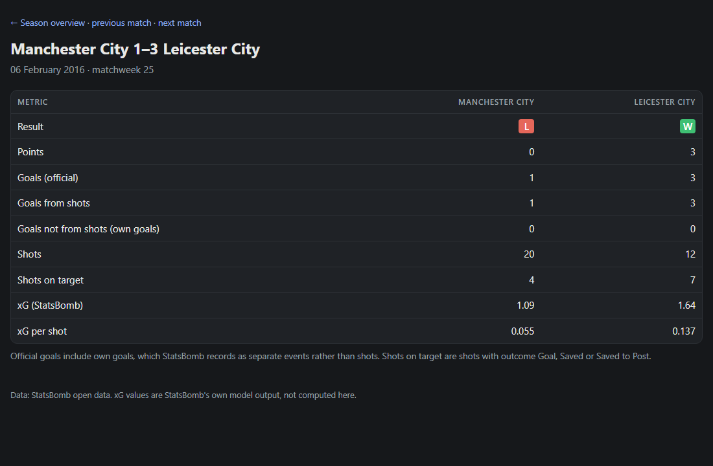
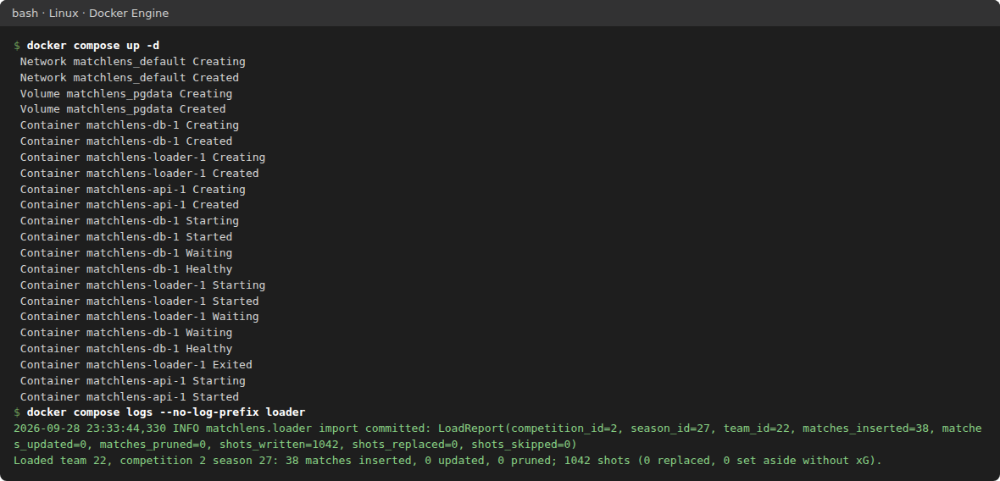
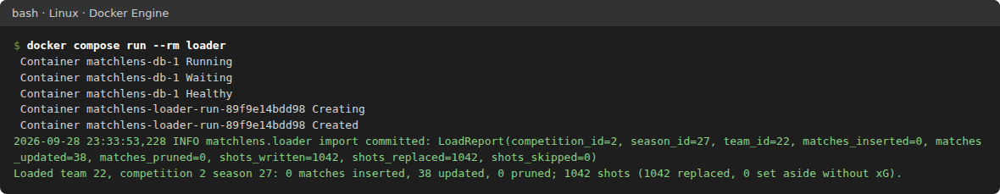
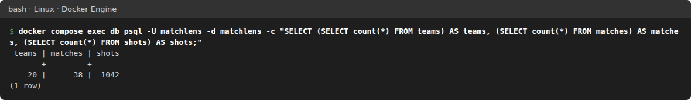
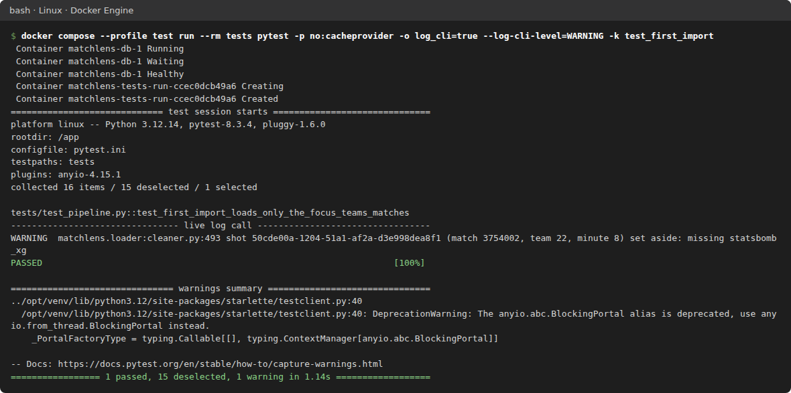
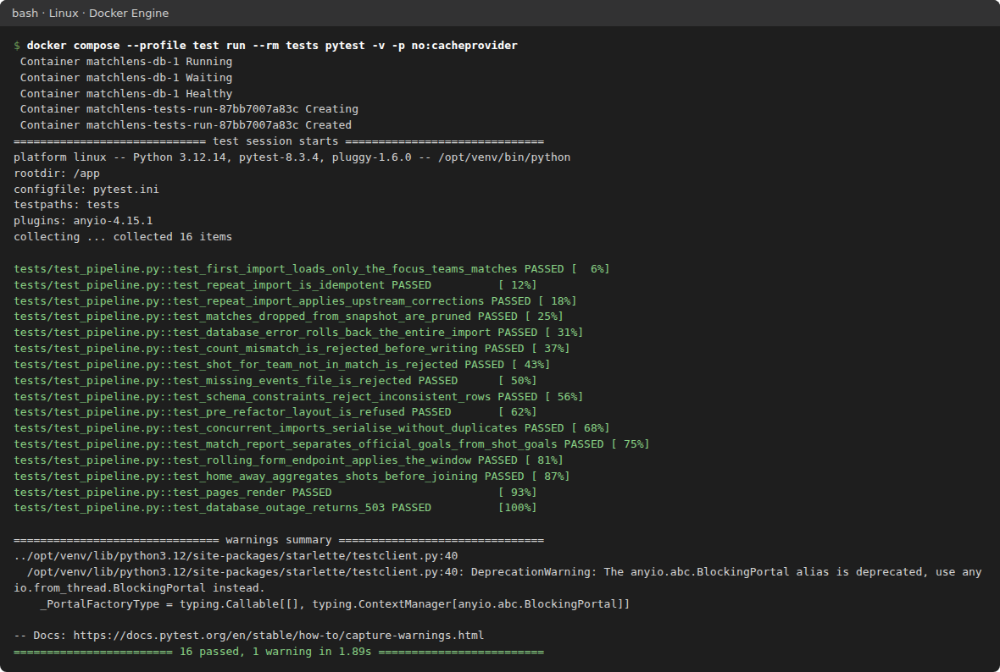
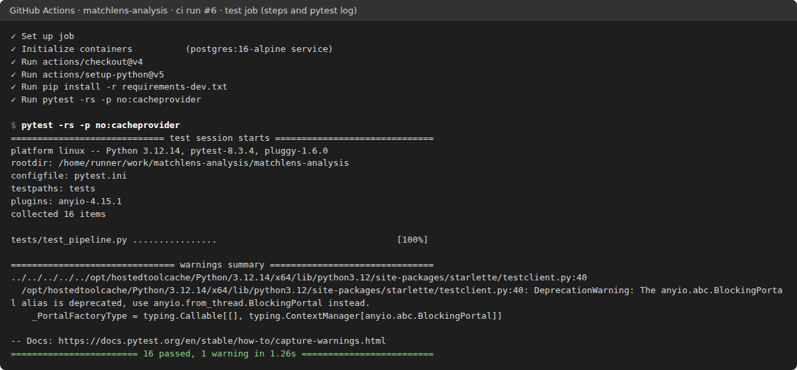
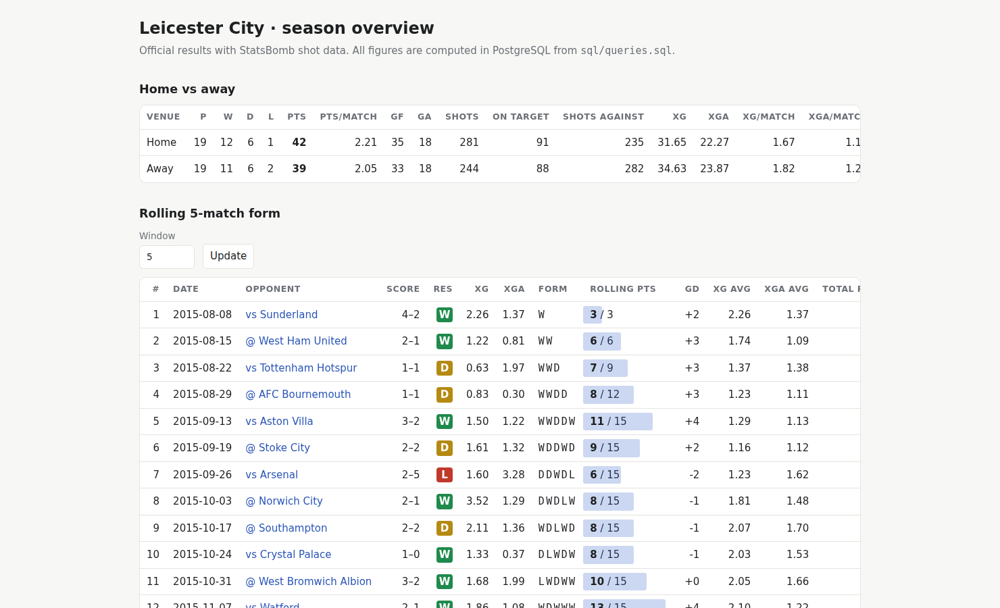
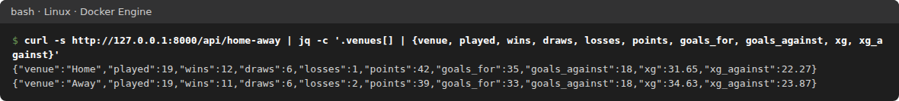
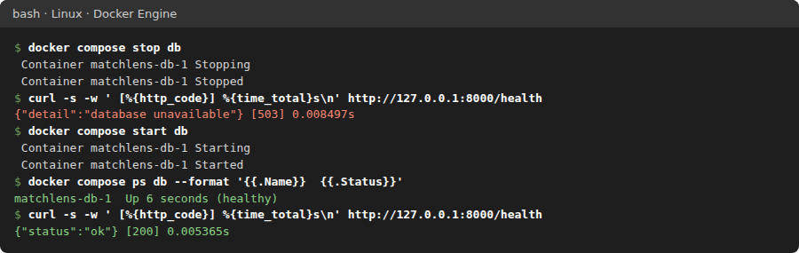

# MatchLens Football Analysis

[](https://github.com/OmarM-Devv/matchlens-analysis/actions/workflows/ci.yml)

Descriptive match analysis of Leicester City's 2015/16 Premier League season, built on StatsBomb open data, PostgreSQL and FastAPI.



The match-report page (`/matches/{match_id}`), captured from a local run against
the loaded 2015/16 data.

## Overview

I built MatchLens to practise loading real event data into a database and
answering questions about it with SQL. It covers Leicester City's 2015/16
Premier League season from StatsBomb's open data: 38 matches and 1,042 shot
events.

A Python loader checks the whole snapshot before writing anything, then loads
it into PostgreSQL in a single transaction. The schema and the analysis
queries live in their own `sql/` folder, and a small FastAPI app serves match
reports, rolling form and a home vs away comparison as web pages and JSON. It
runs locally under Docker Compose, and GitHub Actions runs the 16 integration
tests on every push. It is not deployed.

The main design decisions and their trade-offs are recorded in
[`docs/adr/`](docs/adr/). The cloud deployment side of my work (Terraform, AWS
and CI/CD) is in
[rail-data-pipeline-api](https://github.com/OmarM-Devv/rail-data-pipeline-api).

## How It's Built

### Code and Tests

- **Separation of concerns.** SQL lives in [`sql/`](sql/), not in Python
  strings. The loader ([`loader/cleaner.py`](loader/cleaner.py)) parses,
  validates and writes. The web app ([`app/main.py`](app/main.py)) loads the
  named queries from `sql/queries.sql` and returns typed Pydantic models.
- **Validation before any write.** `validate_dataset()` rejects a snapshot
  before a transaction is opened: wrong match or shot count, duplicate ids, a
  match from the wrong competition-season, a shot credited to a team not in its
  match, a missing events file, or a team id with two names. The database
  enforces the same rules again with CHECK constraints and a trigger.
- **Missing-xG fallback.** `extract_shots()` in `loader/cleaner.py` sets aside
  a shot event whose `statsbomb_xg` is missing or null instead of rejecting the
  whole snapshot. Each one is logged with its shot id, match, team and minute,
  and the rest of the batch loads. Set-aside shots still count towards the
  1,042 guard, so a shot silently deleted upstream is still caught. Any other
  malformed shot field still rejects the snapshot. The current StatsBomb data
  has xG on all 1,042 shots, so the fallback is exercised by the test fixture
  (one shot without xG, [Figure 4](#figure-4--missing-xg-fallback)), not by the
  real data. See [ADR 0002](docs/adr/0002-set-aside-shots-missing-xg.md).
- **Fault handling.** Every import is one transaction under
  `pg_advisory_xact_lock`, so a failure rolls back completely and two imports
  cannot interleave. Connect timeouts (3 s for the app, 10 s for the loader)
  were added after the failure exercise found a 130-second hang. The app
  returns 503 while the database is down and recovers without a restart.
  See [ADR 0001](docs/adr/0001-single-transaction-with-advisory-lock.md).
- **Test patterns.** Integration tests run against a real PostgreSQL in a
  throwaway schema, using a synthetic StatsBomb-shaped fixture. They cover
  idempotency, upstream corrections, pruning, rollback, concurrent imports,
  schema constraints, the aggregate-before-join totals and a database outage.

### Data Pipeline

- **Scoped, guarded ingestion.** The import is pinned to competition 2,
  season 27, team 22 and refuses a snapshot unless it has exactly 38 matches
  and 1,042 shot events. These are data-quality guards, not performance
  settings: they exist to catch silent upstream changes. They are configurable
  (`MATCHLENS_EXPECTED_*`, `--no-count-check`).
- **Idempotent loads.** Teams and matches are upserted, matches missing from a
  new snapshot are pruned, and shots are replaced. Re-running the import leaves
  row counts unchanged, and a post-load count check rolls back on any mismatch.
- **Isolated query management.** The schema (`sql/schema.sql`) and the four
  named queries (`sql/queries.sql`) are plain SQL files. Rolling form uses
  window functions with `ROWS` frames. See
  [ADR 0004](docs/adr/0004-keep-sql-in-named-sql-files.md).
- **Aggregate before join.** Every analytical query groups `shots` to one row
  per `(match_id, team_id)` in a CTE before joining to `team_match_view`.
  Joining raw shots first would repeat each match's goals and points once per
  shot. `test_home_away_aggregates_shots_before_joining` pins the correct
  totals. See [ADR 0003](docs/adr/0003-aggregate-shots-before-joining.md).
- **Measured, not assumed, performance.** A covering index serves the
  per-(match, team) aggregation. `EXPLAIN ANALYZE` on the real data showed the
  planner prefers a sequential scan at 1,042 rows (about 1 ms), so the index is
  kept for larger volumes with no benefit claimed at this size. See
  [`docs/limitations.md`](docs/limitations.md).
- **Orchestrated run order.** Compose starts the database, waits for it to be
  healthy, runs the loader to completion, and only then starts the API.

### Containers and CI

- **Container image.** Multi-stage [`Dockerfile`](Dockerfile): dependencies
  resolved in a builder stage, a slim runtime running as non-root UID 10001, a
  `HEALTHCHECK` on `/health`, and a separate test stage.
- **Hardened Compose stack.** [`docker-compose.yml`](docker-compose.yml) runs
  the app containers with a read-only root filesystem, all Linux capabilities
  dropped and `no-new-privileges`. Ports bind to `127.0.0.1` only.
- **Least-privilege database access.** The API connects as a role with
  `SELECT` grants only, `default_transaction_read_only`, and a 5-second
  statement timeout ([`docker/postgres/initdb/`](docker/postgres/initdb/)).
- **Continuous integration.** [`.github/workflows/ci.yml`](.github/workflows/ci.yml)
  starts a `postgres:16-alpine` service container and runs the suite on
  Python 3.12. When `CI` is set and no database is configured, the fixture
  fails instead of skipping, so the job cannot pass without running the
  integration tests.
- **Incident practice.** A controlled PostgreSQL outage was run, diagnosed,
  fixed and repeated on the compose stack, with a written runbook
  ([`docs/failure_diagnosis.md`](docs/failure_diagnosis.md)).

## Documentation

| Document | Kind | Use it to |
|---|---|---|
| [Setup](#setup) | Tutorial | Run the whole stack from a fresh clone |
| [Testing](#testing) and the [outage runbook](docs/failure_diagnosis.md#runbook-compose-stack) | How-to | Run the tests; diagnose and recover from a database outage |
| [Data Model](#data-model), [Metric Definitions](#metric-definitions), and the OpenAPI docs at `/docs` | Reference | Look up tables, constraints, metric definitions and endpoints |
| [Architecture decision records](docs/adr/) and [limitations](docs/limitations.md) | Explanation | Understand why the design is the way it is, and what it does not cover |

## Project Scope

- **Descriptive analysis only.** Every figure is a count, sum, average or
  window aggregate over recorded events and official results. Nothing is
  predicted, forecast or modelled.
- **xG is provided by StatsBomb.** The project stores StatsBomb's per-shot
  `statsbomb_xg` and aggregates it. It does not compute xG itself.
- **CI only, not deployed.** GitHub Actions runs the test suite. The stack runs
  locally under Docker Compose, bound to `127.0.0.1`. There is no hosted
  instance.

## Tech Stack

| Layer | Technology |
|---|---|
| Database | PostgreSQL 16 |
| Schema and queries | Plain SQL files: `sql/schema.sql`, `sql/queries.sql` |
| Loader | Python 3.12, SQLAlchemy 2.0 (Core `text()` statements), psycopg 3 |
| Web app | FastAPI 0.115, Jinja2 server-rendered templates, uvicorn |
| Tests | pytest, httpx (FastAPI `TestClient`) |
| Runtime | Docker Compose (db, loader, api, tests) |
| CI | GitHub Actions |

## Architecture

```
scripts/fetch_statsbomb.py     download the season match list + Leicester's 38 event files
        │                      → data/statsbomb/matches/2/27.json, data/statsbomb/events/<match_id>.json
        ▼
loader/cleaner.py              parse → validate (38 matches, 1,042 shots) → one transaction
        │                      applies sql/schema.sql, then writes teams · matches · shots
        ▼
PostgreSQL                     sql/schema.sql: 3 tables + team_match_view
        │
        ▼
app/main.py                    loads the named queries in sql/queries.sql
        │                      JSON: /api/matches · /api/matches/{id}/report · /api/form · /api/home-away · /health
        ▼
app/templates/                 pages: / (season overview) · /matches/{id} (match report)

tests/                         PostgreSQL integration suite (16 tests, 31 assertions)
docker/postgres/initdb/        creates the read-only role the app connects as
.github/workflows/ci.yml       runs the suite on every push to main and every pull request
docs/                          adr/ · limitations.md · failure_diagnosis.md · images/
```

## Data and Scope

| | |
|---|---|
| Source | [StatsBomb open data](https://github.com/statsbomb/open-data) |
| Competition / season | Premier League 2015/16 (StatsBomb competition 2, season 27) |
| Team | Leicester City (StatsBomb team 22) |
| Matches | 38 (19 home, 19 away) |
| Shot events | 1,042 in total: 525 by Leicester, 517 by opponents |
| Teams | 20 (Leicester and its 19 opponents) |

The season file lists all 380 league matches. The loader keeps the 38 Leicester
played. Loaded, the data reproduces the official record: 23 wins, 12 draws,
3 defeats, 68 goals for, 36 against, 81 points.

## Data Model

Defined in [`sql/schema.sql`](sql/schema.sql):

| Object | Grain | Notes |
|---|---|---|
| `teams` | one row per club | `team_id` is StatsBomb's id |
| `matches` | one row per fixture | official `home_score` / `away_score`; FKs to `teams`; CHECKs on distinct teams, non-negative scores, match week range |
| `shots` | one row per StatsBomb shot event | `statsbomb_xg`, outcome, body part, technique, location; generated columns `is_goal` and `is_on_target`; `ON DELETE CASCADE` from `matches`; CHECKs on pitch coordinates, clock, period and xG in [0, 1]; unique `(match_id, event_index)` |
| `team_match_view` | two rows per match, one per side | `UNION ALL` of the home and away perspective, with `goals_for`, `goals_against`, `result` and `points` derived from the official score |

A trigger, `shots_team_in_match`, rejects any shot credited to a team that did
not play in that match. A foreign key cannot express "home or away team", so a
trigger does it.

## Ingestion

`python -m loader.cleaner` (the `loader` service in compose) reads the files
written by `scripts/fetch_statsbomb.py`.

Before any database write, the snapshot is validated. It is rejected unless it
has exactly 38 matches and 1,042 shot events, no duplicate match or shot ids,
every match in the expected competition-season, every shot credited to a team
in its match, an events file for every match, and one name per team id.

A shot event with no `statsbomb_xg` value is **set aside** rather than
rejecting the snapshot. It is not written to `shots`, and each one is logged
as a warning with its shot id, match, team and minute. Set-aside shots still
count towards the 1,042 total, so the guard keeps checking how many shot events
StatsBomb published. The summary line reports how many were set aside. Any
other malformed shot field still rejects the snapshot. The current StatsBomb
data has an xG value on all 1,042 shots, so nothing is set aside today.

The import then runs as **one PostgreSQL transaction** holding
`pg_advisory_xact_lock(competition_id, season_id)`:

| Situation | Result |
|---|---|
| Same snapshot imported again | Matches updated in place, shots replaced; row counts unchanged |
| Upstream correction (score changed, shot removed) | New values replace old; removed shots disappear |
| Match missing from a new snapshot | Match pruned; its shots cascade away |
| Any database error mid-import | Full rollback; the previous import is untouched |
| Count or consistency check fails | Rejected before a transaction is opened |
| Shot event without `statsbomb_xg` | Set aside and logged; not loaded; still counted towards the expected total |
| Two imports at once | Serialised by the advisory lock; no duplicates |
| Database unreachable | Gives up after the 10 s connect timeout with exit code 1; nothing written |

After writing, the loader counts the matches and shots in the database and rolls
back if they differ from the snapshot. The expected counts can be overridden
with `--expected-matches` / `--expected-shots` (or `MATCHLENS_EXPECTED_*`), or
turned off with `--no-count-check`.

## Analytical Layer

[`sql/queries.sql`](sql/queries.sql) holds three analytical queries, each under
a `-- name:` header that `app/main.py` loads by name:

| Query | Output | Served at |
|---|---|---|
| `match_report` | One match from both sides: official goals, result, points, shots, shots on target, goals from shots, goals not from shots, xG, xG per shot | `/matches/{id}`, `/api/matches/{id}/report` |
| `rolling_form` | Per match: rolling N-match points, goal difference, average xG and xGA, and form string (`ROWS` window functions), plus cumulative points | `/`, `/api/form?window=5` |
| `home_away` | Home vs away: played, W/D/L, points, points per match, goals, shots, xG and xGA totals and per match | `/`, `/api/home-away` |

A fourth statement, `team_matches`, is a plain fixture lookup for navigation.

**Aggregate before join.** Each analytical query first groups `shots` to one
row per `(match_id, team_id)` in a CTE and only then joins that to
`team_match_view`. Joining raw shots to the view before summing would repeat
each match's goals and points once per shot. The test
`test_home_away_aggregates_shots_before_joining` pins the correct totals.

## Metric Definitions

| Metric | Definition |
|---|---|
| Goals, result, points | From the official score in the match record: 3 for a win, 1 for a draw, 0 for a defeat |
| xG / xGA | Sum of StatsBomb's `statsbomb_xg` over the team's / opponent's shots, as provided |
| Shots | StatsBomb events of type `Shot`, penalties included |
| Shots on target | Shots with outcome `Goal`, `Saved` or `Saved to Post` |
| Goals from shots | Shots with outcome `Goal` |
| Goals not from shots | Official goals minus goals from shots. StatsBomb records own goals as separate events, not shots, so in league data this equals own goals scored in the team's favour. 2015/16 Leicester has one: Leicester City 2–2 West Bromwich Albion, 1 March 2016 |
| xG per shot | xG divided by shots |

## Setup

Requires Git, Docker with Compose, and Python 3 on the host (the fetch script
uses only the standard library). The commands work in bash and in
PowerShell 7 unless marked otherwise.

```bash
git clone https://github.com/OmarM-Devv/matchlens-analysis.git
```

```bash
cd matchlens-analysis
```

```bash
cp .env.example .env
```

Edit `.env` and set `POSTGRES_PASSWORD` and `MATCHLENS_RO_PASSWORD`.

```bash
python scripts/fetch_statsbomb.py
```

This downloads about 105 MB into `data/statsbomb/`.

```bash
docker compose up --build
```

Compose starts `db`, runs `loader` to completion, then starts `api`.

| Service | Address |
|---|---|
| Web app, season overview | http://127.0.0.1:8000/ |
| Match report | http://127.0.0.1:8000/matches/{match_id} |
| OpenAPI docs | http://127.0.0.1:8000/docs |
| Health check | http://127.0.0.1:8000/health |
| PostgreSQL | 127.0.0.1:5432 (database and user `matchlens`) |

Both ports can be changed with `API_PORT` and `POSTGRES_PORT` in `.env`. Both
bind to `127.0.0.1` only. The app connects as the read-only role
`MATCHLENS_RO_USER`, which has `SELECT` grants only.

Re-running the import is safe:

```bash
docker compose run --rm loader
```

A database created before this layout (with a `team_match_views` table) is
refused by the loader. Reset it with `docker compose down -v`, which deletes all
loaded data.

## Testing

```bash
docker compose --profile test run --rm tests
```

Or, against any PostgreSQL where the role can `CREATE SCHEMA`:

```bash
TEST_DATABASE_URL=postgresql+psycopg://matchlens:<password>@127.0.0.1:5432/matchlens pytest
```

In PowerShell 7:

```powershell
$env:TEST_DATABASE_URL = "postgresql+psycopg://matchlens:<password>@127.0.0.1:5432/matchlens"
pytest
```

The suite has 16 tests containing 31 assertions. Each session creates a
throwaway schema and drops it afterwards. The fixture is a synthetic 6-match
season (34 shot events, one of them without xG; one own goal; and one match
the focus team did not play).

| Area | What is asserted |
|---|---|
| First import | Only the focus team's matches load; the shot without xG is set aside but counted; counts for teams, matches, shots and the team view |
| Repeat import | Idempotent: counts and shot rows unchanged, `loaded_at` advances |
| Upstream corrections | Changed score updates the result and points; removed shot disappears |
| Pruning | A match dropped from the snapshot is deleted along with its shots |
| Rollback | A constraint failure mid-import leaves matches and shots exactly as before |
| Validation | Wrong shot count (reported as loaded plus set aside), shot for a team not in the match, and missing events file are rejected with nothing written |
| Schema | The team-in-match trigger, the xG range CHECK and the distinct-teams CHECK reject bad rows; the pre-refactor layout is refused |
| Concurrency | Two simultaneous imports serialise with no duplicates |
| Match report | Official goals, goals from shots, goals not from shots, shots, shots on target and xG for both sides |
| Rolling form | Window sizes, rolling points and form string for a 5-match window |
| Home vs away | Played, points, goals and shots per venue (aggregate-before-join) |
| Pages | Season overview and match report render |
| Outage | `/health` and `/` return 503 when the database is unreachable |

The real 38-match snapshot is not part of the suite. Its counts are enforced by
the loader at import time.

## CI Configuration

[`.github/workflows/ci.yml`](.github/workflows/ci.yml) runs on every push to
`main` and every pull request. It starts a `postgres:16-alpine` service
container, installs `requirements-dev.txt` on Python 3.12 and runs `pytest`.
When `CI` is set and no database is configured, the database fixture fails
instead of skipping, so the job cannot pass without running the integration
tests. For the job to block merges, it also has to be marked as a required
status check in the repository's branch protection settings. The workflow has
no build, publish or deploy steps.

## Failure Exercise

[`docs/failure_diagnosis.md`](docs/failure_diagnosis.md) records a controlled
PostgreSQL outage. PostgreSQL was stopped while the app was serving requests,
the symptoms were observed, and the database was restored.

- **Found:** with the database down, each request hung for 130 seconds before
  returning 503. That is psycopg's default connect deadline, because the engine
  had no `connect_timeout`.
- **Fixed:** the app now uses a 3-second connect timeout and the loader a
  10-second one. With the fix, `/health`, pages and JSON endpoints returned 503
  in about 3 seconds, and the loader exited with code 1 after 12 seconds,
  writing nothing.
- **Recovered:** after PostgreSQL restarted, the app returned 200 again without
  a restart. Row counts were unchanged at 38 matches and 1,042 shots.

- **Repeated on the compose stack** with `docker compose stop db`: 503s in
  about 4 seconds (`Name or service not known`, because a stopped container's
  hostname stops resolving), then recovery after `docker compose start db`
  without restarting `api`.

The document also has the compose runbook used for that run.

## System Verification

Screenshots of the system running: terminal output captured on Linux with
Docker Engine and rendered as images without editing, the season page
from a browser, and one from GitHub Actions. Each figure lists the command
that produced it, so a reviewer can reproduce it after the [Setup](#setup)
steps. All images are in `docs/images/`:

```
docs/
├── images/
│   ├── match-report.png                  match report page (top of this README)
│   ├── 01-loader-first-import.png        Figure 1
│   ├── 02-loader-idempotent-rerun.png    Figure 2
│   ├── 03-database-row-counts.png        Figure 3
│   ├── 04-missing-xg-set-aside.png       Figure 4
│   ├── 05-test-suite.png                 Figure 5
│   ├── 06-ci-run.png                     Figure 6
│   ├── 07-season-overview.png            Figure 7
│   ├── 08-home-away-api.png              Figure 8
│   └── 09-outage-and-recovery.png        Figure 9
├── failure_diagnosis.md
└── limitations.md
```

| Figure | What it shows | Area |
|---|---|---|
| 1 | Snapshot validated and committed in one transaction | Data engineering |
| 2 | Re-running the import changes nothing | Data engineering |
| 3 | 20 teams, 38 matches, 1,042 shots in PostgreSQL | Data engineering |
| 4 | A shot without xG is set aside and logged; the import still succeeds | Software engineering |
| 5 | 16 integration tests pass against PostgreSQL | Software engineering |
| 6 | The same suite passes in GitHub Actions | DevOps |
| 7 | Season overview page served from the database | Software engineering |
| 8 | Home/away totals add up to the official record (aggregate before join) | Data engineering |
| 9 | Database outage returns a fast 503, then recovers without a restart | DevOps |

### Figure 1 · First import



The one-shot `loader` container validated the snapshot (competition 2,
season 27, 38 matches, 1,042 shot events) and committed it in a single
transaction. The summary line reports 38 matches inserted and 1,042 shots
written, with none set aside.

```bash
docker compose up -d --build
docker compose logs --no-log-prefix loader
```

### Figure 2 · Idempotent re-run



Running the same import again updates the 38 matches in place and replaces the
1,042 shots. Nothing is duplicated.

```bash
docker compose run --rm loader
```

### Figure 3 · Row counts in PostgreSQL



Counts read straight from the database after the import.

```bash
docker compose exec db psql -U matchlens -d matchlens -c "SELECT (SELECT count(*) FROM teams) AS teams, (SELECT count(*) FROM matches) AS matches, (SELECT count(*) FROM shots) AS shots;"
```

### Figure 4 · Missing-xG fallback



The fixture includes one shot event without `statsbomb_xg`. The loader logs a
warning naming the shot, match, team and minute, sets it aside, and loads the
rest of the batch. The test then checks that it was counted but not written.

```bash
docker compose --profile test run --rm tests pytest -p no:cacheprovider -o log_cli=true --log-cli-level=WARNING -k test_first_import
```

### Figure 5 · Test suite



All 16 integration tests pass against the compose PostgreSQL, each session in
its own throwaway schema.

```bash
docker compose --profile test run --rm tests pytest -v -p no:cacheprovider
```

### Figure 6 · CI run



The `ci` workflow on GitHub Actions: a `postgres:16-alpine` service container
and the same 16 tests on Python 3.12. The image shows the job's steps and the
pytest section of its log, as returned by the GitHub API; the run itself is
[ci run #6](https://github.com/OmarM-Devv/matchlens-analysis/actions/runs/36496439029).

### Figure 7 · Season overview page



The season overview page at `http://127.0.0.1:8000/`: the home vs away table
and the rolling 5-match form, rendered from the named queries in `sql/`.

### Figure 8 · Home vs away through the API



Home: 19 played, 12 won, 6 drawn, 1 lost. The two rows add up to the official
23 wins, 12 draws, 3 defeats and 81 points, which only holds because shots are
aggregated before the join.

```bash
curl -s http://127.0.0.1:8000/api/home-away | jq -c '.venues[] | {venue, played, wins, draws, losses, points, goals_for, goals_against, xg, xg_against}'
```

In PowerShell 7:

```powershell
(Invoke-RestMethod http://127.0.0.1:8000/api/home-away).venues | Format-Table venue, played, wins, draws, losses, points, goals_for, goals_against, xg, xg_against
```

### Figure 9 · Outage and recovery



With the database container stopped, `/health` returns 503 straight away
instead of hanging (0.01 s in this run on Linux; about 4 s on Docker Desktop
in the recorded [failure exercise](docs/failure_diagnosis.md)). Once `db` is
healthy again, it returns 200 without restarting `api`.

```bash
docker compose stop db
curl -s -w ' [%{http_code}] %{time_total}s\n' http://127.0.0.1:8000/health
docker compose start db
docker compose ps db
curl -s -w ' [%{http_code}] %{time_total}s\n' http://127.0.0.1:8000/health
```

## Limitations

Summarised from [`docs/limitations.md`](docs/limitations.md), which also has the
query-plan notes:

- One team and one season. Opponent figures cover only their games against
  Leicester.
- The 1,042-shot guard is tied to the current StatsBomb release. An upstream
  revision will make imports fail until the expected count is updated.
- Shots without an xG value are set aside, not loaded, so they are missing
  from shot counts and xG totals (none in the current data).
- xG is StatsBomb's value as provided, penalties included. The model version is
  not recorded.
- Own goals are derived (official goals minus goals from shots), not stored as
  events.
- The team-in-match rule is enforced on shot writes only. It is not re-checked
  if a match's teams are changed afterwards.
- The schema file is not a migration tool. Older databases must be recreated.
- Local only: no authentication, no caching or pagination, not deployed.
- Tests use a synthetic fixture. The real snapshot is checked only by the
  loader's count guard.
- At 1,042 shots, PostgreSQL chooses a sequential scan over the covering index;
  the home/away query executed in about 1 ms.

## What I Learned

- Checking the whole snapshot before opening a transaction, then writing it in
  one transaction, means a failed import never leaves half the data behind.
- Joining raw shots to per-match results repeats each match's points once per
  shot. The numbers still look plausible, so I aggregate shots before joining
  and pinned the correct totals with a test.
- One missing value doesn't have to block a whole batch. Setting aside shots
  without xG, while still counting them, keeps the load going without hiding
  the problem.
- A database connection with no timeout can hang for over two minutes when the
  database is down. I found this in a controlled outage and fixed it with
  connect timeouts.
- An index isn't automatically used. At 1,042 rows PostgreSQL chose a
  sequential scan, which I only knew because I checked the plan with
  `EXPLAIN ANALYZE`.
- Integration tests against a real PostgreSQL database catch problems that
  mocks would hide, such as constraint and trigger behaviour.

## Future Improvements

These are future ideas, not completed parts of this project:

- Use a migration tool such as Alembic instead of recreating the database when
  the schema changes.
- Load more teams and seasons, which would need batching and a fresh look at
  the indexes.
- Add authentication and caching before any public deployment.
- Deploy it, reusing the approach from rail-data-pipeline-api.

Data: [StatsBomb open data](https://github.com/statsbomb/open-data), used under
its licence terms with attribution.
